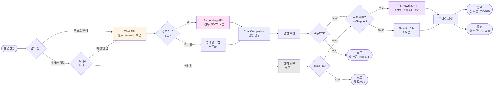
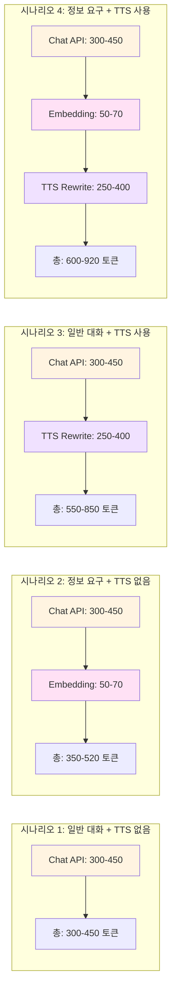

# API 호출 플로우 다이어그램

## 기술별 호출 타이밍 정리

### 1. STT API (Speech-to-Text)
- **호출 화면**: `MainPageV1` 컴포넌트
- **호출 함수**: `processAudio` → `apiRequests.sendSTTRequest`
- **호출 타이밍**: 음성 녹음 종료 시 (stopRecording → processAudio)
- **호출 조건**: 음성 입력 사용 시에만 (텍스트 입력 시에는 호출 안 됨)
- **API 엔드포인트**: `/api/stt`
- **결과**: 인식된 텍스트 반환
- **토큰 사용**: 없음 (API 사용료 별도)

### 2. Chat API
- **호출 화면**: `MainPageV1` 컴포넌트
- **호출 함수**: `handleSubmit`, `processAudio`, 또는 `handleRecommendationClick` → `apiRequests.sendChatRequest`
- **호출 타이밍**:
  - 텍스트 입력: `handleSubmit` (엔터/제출 버튼 클릭 시)
  - 음성 입력: `processAudio` 내부 (STT 성공 후 자동 호출)
  - 추천안 클릭: `handleRecommendationClick` 내부 (**조건부**: 고정 QA 데이터에 매칭되지 않을 때만)
- **호출 조건**: 
  - 텍스트/음성 입력: 항상 (필수)
  - 추천안 클릭: 고정 QA 데이터에 매칭되지 않을 때만 (조건부)
- **API 엔드포인트**: `/api/chat`
- **결과**: AI 답변, 토큰 정보, 추천 정보 등
- **토큰 사용**: 300-450 토큰/질문 (조건부 - 추천안의 경우 고정 데이터 사용 시 0 토큰)

### 3. Embedding API (CLOVA Embedding)
- **호출 화면**: 백엔드 (`/api/chat` 엔드포인트 내부)
- **호출 함수**: `embedText` → CLOVA Embedding API 호출
- **호출 타이밍**: 
  1. Chat API 요청 수신 (`POST /api/chat`)
  2. System Prompt 로드 완료
  3. **질문 분류 실행** (`isInfoRequestQuestion` - 키워드 기반, 동기 함수)
  4. **분류 결과가 "정보 요구 질문"인 경우에만 실행**
  5. **Chat Completion API 호출 전에 실행** (RAG Context 구성용)
- **호출 조건**: 
  - 정보 요구 키워드 포함 시에만
  - 키워드 예시: '추천', '알려', '어디', '어떤', '정보', '위치', '일정', '식당', '카페', '이벤트', '전시', '행사', '장소', '곳', '보여', '가르쳐', '안내', '소개', '찾아', '보고'
- **호출 순서**:
  ```
  Chat API 요청 → System Prompt 로드 → 질문 분류 → [정보 요구?] 
  → Embedding API 호출 → RAG 검색 → Context 구성 → Chat Completion API 호출
  ```
- **API**: CLOVA Embedding API (`/v2/api/embedding`)
- **결과**: 질문 텍스트의 벡터 임베딩 (RAG 검색용)
- **토큰 사용**: 50-70 토큰/질문 (조건부 - 정보 요구 질문일 때만)
- **참고**: 질문 분류는 API 호출 없이 프론트엔드/백엔드 양쪽에서 키워드 기반으로 동기적으로 수행

### 4. TTS Rewrite API
- **호출 화면**: `useCoexTTS` 훅 (`prepareAuto` → `preparePlayback`)
- **호출 함수**: `rewriteTextForTTS` → `/api/tts-rewrite`
- **호출 타이밍**: Chat API 응답 후 `pushAssistantMessage` → `prepareAuto` 호출 시
- **호출 조건**: 
  - `skipTTS`가 `false`이고
  - `useSnippet`이 `true`일 때만 (자동 재생 사용 시)
- **API 엔드포인트**: `/api/tts-rewrite`
- **결과**: TTS 전용 재작성된 텍스트
- **토큰 사용**: 250-400 토큰/질문 (조건부)

### 5. TTS API (CLOVA Voice)
- **호출 화면**: `useCoexTTS` 훅 (`preparePlayback`)
- **호출 함수**: `requestTTS` → `/api/tts`
- **호출 타이밍**: TTS Rewrite API 호출 후 (또는 Rewrite 없이 바로)
- **호출 조건**: `skipTTS`가 `false`일 때
- **API 엔드포인트**: `/api/tts` → CLOVA Voice API
- **결과**: 오디오 Blob (MP3)
- **토큰 사용**: 없음 (API 사용료 별도)

---

### 6. 온보딩 선택지 처리 (Onboarding Options)
- **호출 화면**: `OnboardingPage` 컴포넌트
- **호출 함수**: `handleButtonClick` → `onComplete`
- **호출 타이밍**: "가족과 함께", "연인과 둘이", "친구랑 같이", "혼자서 자유롭게" 버튼 클릭 시
- **API 호출**: **없음** (프론트엔드 상태 관리만)
- **처리 방식**:
  - 선택된 옵션을 state에 저장 (`setSelectedOption`)
  - 애니메이션 표시 후 MainPage로 전환
  - `selectedOnboardingOption` props로 MainPageV1에 전달
  - 이후 추천 질문 필터링에만 사용 (고정 데이터에서 해당 옵션의 질문만 표시)
- **토큰 사용**: **0 토큰** (API 호출 없음)
- **참고**: 온보딩 선택 후 MainPage에서 "시작하기" 버튼(`handleGoButton`) 클릭 시 Chat API 호출 (별도)

### 7. 추천안 처리 (Fixed QA Data)
- **호출 화면**: `MainPageV1` 컴포넌트
- **호출 함수**: `handleRecommendationClick`
- **호출 타이밍**: 추천안(추천 칩) 클릭 시
- **처리 방식**:
  - **Case 1**: 고정 QA 데이터에 매칭되는 경우
    - `findQAByQuestion`으로 매칭 (온보딩 옵션 사용)
    - Chat API 호출 없음
    - 고정 답변을 직접 표시 (`pushAssistantMessage`에 `tokens: undefined`)
    - 토큰 사용: 0 토큰
  - **Case 2**: 고정 QA 데이터에 매칭되지 않는 경우
    - Chat API 호출 (`apiRequests.sendChatRequest`)
    - 일반 질문 처리와 동일
    - 토큰 사용: 300-450 토큰 (일반 대화) 또는 350-520 토큰 (정보 요구)
- **결과**: 고정 답변 또는 AI 생성 답변

---

## Mermaid 다이어그램

### 전체 플로우

```mermaid
flowchart TD
    Start([사용자 입력]) --> InputType{입력 방식}
    
    InputType -->|텍스트 입력| TextInput[handleSubmit<br/>MainPageV1]
    InputType -->|음성 입력| VoiceInput[음성 녹음 시작<br/>handleTouchStart]
    InputType -->|추천안 클릭| RecommendationClick[handleRecommendationClick<br/>MainPageV1]
    
    VoiceInput --> Recording[녹음 중...<br/>AudioWaveVisualizer]
    Recording --> StopRecord[녹음 종료<br/>handleTouchEnd]
    StopRecord --> ProcessAudio[processAudio<br/>MainPageV1]
    ProcessAudio --> STT[/api/stt<br/>STT API 호출]
    STT --> STTResult{STT 성공?}
    STTResult -->|실패| STTError[에러 알림]
    STTResult -->|성공| ChatRequest1[텍스트 추출]
    
    TextInput --> ChatRequest1
    ChatRequest1 --> AddUserMsg[사용자 메시지 추가<br/>chatState.addMessage]
    AddUserMsg --> SetLoading[isLoading = true<br/>생각 중이에요 화면]
    
    RecommendationClick --> CheckFixedQA{고정 QA 데이터<br/>매칭?}
    CheckFixedQA -->|매칭됨| FixedAnswer[고정 답변 표시<br/>tokens: undefined<br/>토큰: 0]
    CheckFixedQA -->|매칭 안됨| AddUserMsg
    
    SetLoading --> ChatAPI[/api/chat<br/>Chat API 호출]
    
    ChatAPI --> CheckInfo{정보 요구<br/>질문인가?<br/>키워드 체크}
    CheckInfo -->|예| Embedding[CLOVA Embedding API<br/>임베딩 생성]
    Embedding --> RAG[RAG 검색<br/>벡터 유사도 계산]
    RAG --> BuildContext[Context 구성]
    BuildContext --> ChatCompletion
    CheckInfo -->|아니오| ChatCompletion[CLOVA Chat API<br/>답변 생성]
    
    ChatCompletion --> ChatResponse[AI 답변 수신]
    ChatResponse --> PushAssistant[pushAssistantMessage<br/>답변 추가]
    PushAssistant --> SetLoading2[isLoading = false]
    
    SetLoading2 --> CheckSkipTTS{skipTTS?<br/>TTS 스킵?}
    CheckSkipTTS -->|true| End1([종료<br/>답변만 표시])
    
    CheckSkipTTS -->|false| PrepareAuto[prepareAuto<br/>useCoexTTS]
    PrepareAuto --> BuildSnippet[스니펫 생성<br/>첫/마지막 문장 추출]
    BuildSnippet --> RewriteCheck{useSnippet?<br/>자동 재생?}
    
    RewriteCheck -->|true| TTSRewrite[/api/tts-rewrite<br/>TTS Rewrite API 호출]
    TTSRewrite --> RewrittenText[재작성된 텍스트]
    RewrittenText --> TTSAPI
    RewriteCheck -->|false| TTSAPI[/api/tts<br/>TTS API 호출<br/>CLOVA Voice]
    
    TTSAPI --> AudioBlob[오디오 Blob 수신]
    AudioBlob --> PlayAudio[오디오 재생<br/>audioManager.playAudio]
    PlayAudio --> End2([종료<br/>답변 + TTS 재생])
    
    style STT fill:#e1f5ff
    style ChatAPI fill:#fff4e1
    style Embedding fill:#ffe1f5
    style TTSRewrite fill:#f0e1ff
    style TTSAPI fill:#e1ffe1
```

### 토큰 사용 플로우



### 화면별 기술 호출 위치

```mermaid
graph TB
    subgraph "프론트엔드: MainPageV1.tsx"
        A1[텍스트 입력<br/>InputField] --> A2[handleSubmit]
        A2 --> A3[apiRequests.sendChatRequest]
        
        B1[음성 버튼 클릭] --> B2[handleTouchStart]
        B2 --> B3[음성 녹음 시작]
        B3 --> B4[handleTouchEnd]
        B4 --> B5[processAudio]
        B5 --> B6[apiRequests.sendSTTRequest]
        B6 --> B7[apiRequests.sendChatRequest]
        
        A3 --> C1[pushAssistantMessage]
        B7 --> C1
        C1 --> C2{skipTTS?}
        C2 -->|false| C3[prepareAuto]
    end
    
    subgraph "프론트엔드: useCoexTTS.ts"
        C3 --> D1[preparePlayback]
        D1 --> D2{useSnippet?}
        D2 -->|true| D3[rewriteTextForTTS]
        D2 -->|false| D5[requestTTS]
        D3 --> D4[/api/tts-rewrite]
        D4 --> D5
        D5 --> D6[/api/tts]
        D6 --> D7[오디오 재생]
    end
    
    subgraph "백엔드: /api/chat"
        E1[Chat API 수신] --> E2{정보 요구<br/>질문?}
        E2 -->|예| E3[embedText<br/>CLOVA Embedding]
        E3 --> E4[RAG 검색]
        E4 --> E5[CLOVA Chat Completion]
        E2 -->|아니오| E5
        E5 --> E6[답변 반환]
    end
    
    A3 -.->|POST /api/chat| E1
    B6 -.->|POST /api/stt| F1[STT API]
    D4 -.->|POST /api/tts-rewrite| G1[TTS Rewrite API]
    D6 -.->|POST /api/tts| H1[TTS API]
    
    style A3 fill:#fff4e1
    style B6 fill:#e1f5ff
    style E3 fill:#ffe1f5
    style D4 fill:#f0e1ff
    style D6 fill:#e1ffe1
```

### 상황별 토큰 사용량 비교



